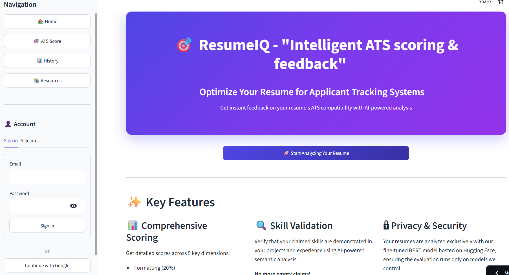
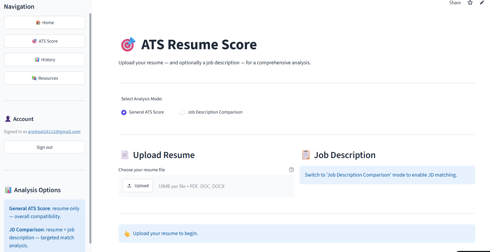
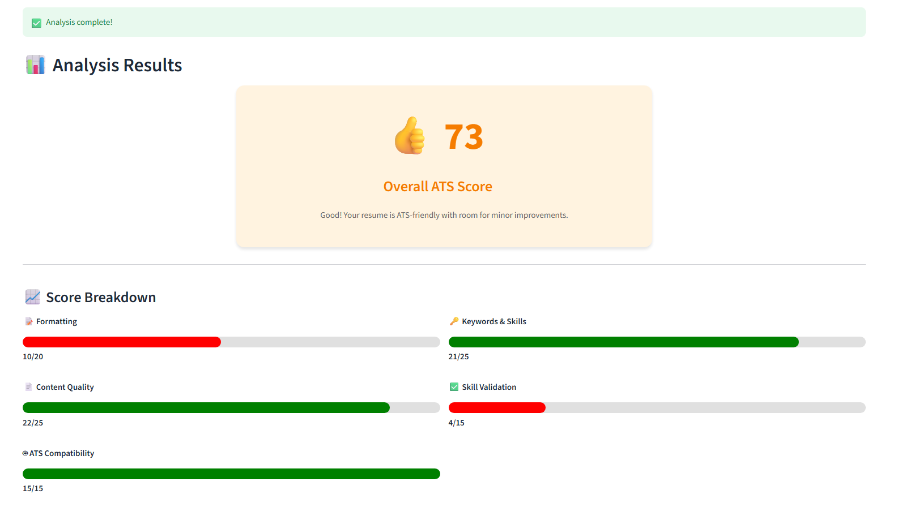
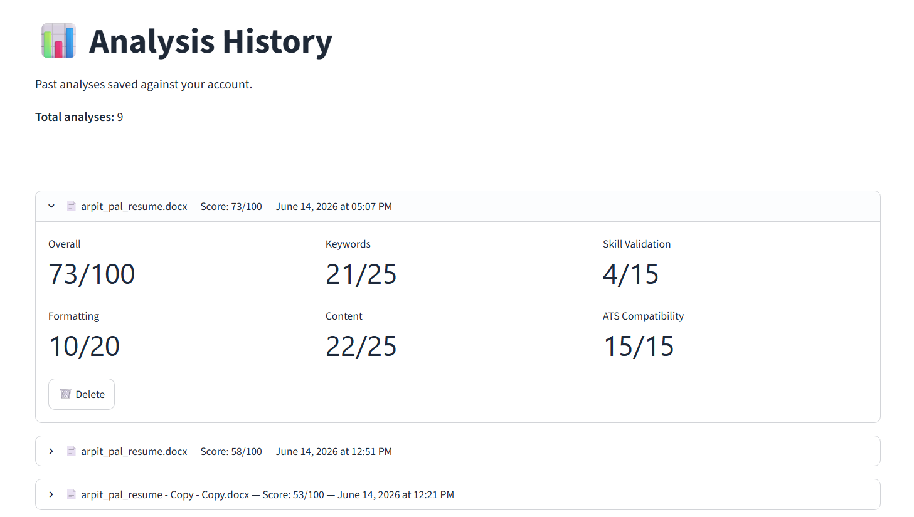

# ResumeIQ: Intelligent ATS Scoring & Feedback


ResumeIQ is an AI-powered resume analysis application that evaluates resumes for Applicant Tracking System (ATS) compatibility and provides clear, actionable feedback. It is built with `Streamlit` for the user interface, `FastAPI` for the analysis backend, `Supabase` for authentication and storage, and NLP/ML pipelines powered by `spaCy`, a **fine-tuned BERT embedding model**, and `Groq LLM`.

In production, the project uses a **split deployment architecture**: the lightweight **Streamlit frontend** runs on Streamlit Cloud, while the memory-heavy **FastAPI backend** (spaCy, PyTorch, Sentence Transformers, WeasyPrint, and related dependencies) runs on **Hugging Face Spaces** via the project `Dockerfile`. The custom **fine-tuned BERT model** is hosted separately on the **Hugging Face Hub** and loaded at runtime through the `SENTENCE_TRANSFORMER_MODEL` environment variable.

The project is designed as a practical demonstration of how AI and NLP can help job seekers optimize resumes, compare them against job descriptions, validate claimed skills, and track analysis history over time.

## Overview

ResumeIQ provides two main analysis workflows:

- a **General ATS Score** mode for resume-only evaluation across formatting, keywords, content, skill validation, and ATS compatibility
- a **Job Description Comparison** mode for targeted resume-to-JD matching with keyword overlap, semantic similarity, and skills gap analysis

The system combines:

- resume file parsing for PDF, DOC, and DOCX uploads
- LLM-based structured resume and JD parsing
- multi-component ATS scoring with weighted interpretation
- semantic skill validation against projects and experience
- job description matching using fuzzy matching and fine-tuned BERT semantic embeddings
- detailed issue detection, recommendations, and action items
- authenticated user history and PDF report export

This makes the project useful both as:

- a learning project for AI-powered resume and ATS systems
- a portfolio project for Python, FastAPI, Streamlit, and Supabase development
- a practical prototype for resume optimization and job-description alignment

## Live Links

- **Main Streamlit App (Frontend):** https://resumeiq-ap.streamlit.app/
- **FastAPI Backend (Hugging Face Spaces):** deployed as a Docker Space using the project `Dockerfile`
- **Fine-Tuned BERT Model (Hugging Face Hub):** loaded remotely by the backend through `SENTENCE_TRANSFORMER_MODEL` in `.env`

## Deployment Architecture

ResumeIQ is deployed as a **three-part production setup** instead of a single monolithic app:

| Component | Platform | Why This Platform |
|-----------|----------|-------------------|
| Frontend UI | **Streamlit Cloud** | Lightweight UI layer; easy auth, upload, and dashboard rendering |
| FastAPI Backend | **Hugging Face Spaces (Docker)** | Heavy Python/ML dependencies need more memory and a containerized runtime |
| Fine-Tuned BERT Model | **Hugging Face Hub** | Large model weights are stored separately and pulled at backend startup |

### Why The Backend Runs On Hugging Face Spaces

The backend dependencies are memory-intensive and not ideal for a small Streamlit-only deployment:

- `torch` (CPU build)
- `sentence-transformers`
- `spacy` with `en_core_web_md`
- `pdfplumber`, `PyPDF2`, `python-docx`, `python-magic`
- `weasyprint` and its system libraries
- model loading at FastAPI startup

Because of this, the backend is containerized with the project `Dockerfile` and deployed to **Hugging Face Spaces**, which provides the memory and environment needed to run the full analysis pipeline reliably.

### How The Production Services Connect

1. The user opens the **Streamlit app** on Streamlit Cloud.
2. The frontend authenticates through **Supabase**.
3. When analysis is triggered, the frontend sends the resume to the **Hugging Face Spaces FastAPI backend** using the backend URL stored in Streamlit secrets.
4. The backend loads the **fine-tuned BERT model** from Hugging Face Hub using `SENTENCE_TRANSFORMER_MODEL`.
5. The backend returns the analysis result to Streamlit, and the result is saved in **Supabase** history.

### Hugging Face Backend Deployment (`Dockerfile`)

The root `Dockerfile` is used specifically for **Hugging Face Spaces backend deployment**. It:

- uses `python:3.12-slim` as the base image
- installs system packages required by `python-magic` and `WeasyPrint`
- copies the project and installs `requirements.txt`
- downloads spaCy models `en_core_web_md` and `en_core_web_sm`
- exposes port `7860` (required by Hugging Face Spaces)
- starts the API with:

```bash
uvicorn backend.main:app --host 0.0.0.0 --port 7860
```

In Hugging Face Spaces, backend secrets such as `GROQ_API_KEY`, Supabase credentials, and `SENTENCE_TRANSFORMER_MODEL` should be configured in the Space settings so the container can load the fine-tuned model and connect to external services.

## Why This Project

Traditional resume review is often:

- slow and manual
- inconsistent across reviewers
- difficult to scale for many candidates
- weak at measuring ATS compatibility objectively
- hard to compare against a specific job description

ResumeIQ aims to improve this process by automatically parsing resumes, scoring them across multiple ATS-relevant dimensions, validating whether listed skills are supported by projects or experience, and generating structured feedback that users can act on immediately.

## Problem Statement

Many candidates struggle to understand why their resumes fail ATS screening or receive low recruiter response rates. Common challenges include:

- unclear formatting that ATS systems cannot parse reliably
- missing or weak keyword alignment with target roles
- skills listed without supporting project or experience evidence
- resumes that are not tailored to a specific job description
- no easy way to track improvements across resume versions

ResumeIQ addresses this by building a resume intelligence system where:

- users can upload resumes in common formats
- the backend extracts and structures resume content using AI
- ATS scores and component breakdowns are generated automatically
- optional JD comparison highlights matched and missing keywords
- users can save history, export reports, and revisit past analyses

## What The Project Does

The application supports:

- user sign-up and sign-in with email/password
- Google OAuth sign-in through Supabase
- resume upload in PDF, DOC, and DOCX formats
- general ATS scoring without a job description
- job description comparison using pasted or `.txt` JD input
- structured resume parsing via Groq LLM
- five-component ATS scoring engine
- semantic skill validation against projects and experience
- detailed feedback with severity, ATS impact, and fix suggestions
- prioritized recommendations and action items
- analysis history storage per user
- PDF report generation and text summary export
- ATS tips and industry keyword resources

## Key Features

- Streamlit-based interactive interface with sidebar navigation
- FastAPI backend with modular service architecture
- Supabase authentication and PostgreSQL-backed analysis history
- Resume parsing pipeline with MIME validation and multi-library PDF extraction
- Groq LLM parsing for structured resume and JD extraction
- spaCy-powered NLP for entity and skills-related processing
- fine-tuned BERT embeddings hosted on Hugging Face Hub for semantic similarity
- split deployment: Streamlit frontend + Hugging Face Spaces backend
- RapidFuzz-based fuzzy keyword matching
- Weighted ATS scoring across five components
- Skill validation dashboard showing validated vs unvalidated skills
- JD match analysis with matched keywords, missing keywords, and skills gap
- Detailed feedback engine with issue severity and action items
- PDF export using Jinja2 templates and WeasyPrint
- Cached model loading at FastAPI startup for better performance
- JWT-protected API endpoints for authenticated analysis and history access

## Demo

### Home Screen



### ATS Score upload and analysis mode selection



### Result Dashboard With Score Breakdown



### Analysis History Page




## Tech Stack

- Python
- Streamlit
- FastAPI
- Uvicorn
- Supabase
- Pydantic
- spaCy
- Sentence Transformers
- PyTorch (CPU)
- Groq LLM
- NumPy
- RapidFuzz
- pdfplumber
- PyPDF2
- python-docx
- python-magic
- httpx
- PyJWT
- Jinja2
- WeasyPrint
- requests

## Project Structure

- `frontend/app.py` - Streamlit app entrypoint, auth flow, and view routing
- `frontend/views/landing.py` - landing page and product overview
- `frontend/views/scorer.py` - resume upload, analysis trigger, and export flow
- `frontend/views/history.py` - saved analysis history and deletion
- `frontend/views/resources.py` - ATS tips and keyword resources
- `frontend/components/` - reusable result UI sections such as score display, JD comparison, feedback, and recommendations
- `frontend/services/api_client.py` - HTTP client for FastAPI backend endpoints
- `frontend/services/supabase_client.py` - Supabase auth client for sign-in, sign-up, and OAuth
- `frontend/assets/style.css` - custom Streamlit styling
- `backend/main.py` - FastAPI entrypoint, CORS, and model startup lifecycle
- `backend/api/routes.py` - analysis, history, health, and PDF API endpoints
- `backend/api/auth.py` - Supabase JWT verification and user identity extraction
- `backend/services/resume_parser.py` - file validation and text extraction from PDF/DOC/DOCX
- `backend/services/groq_parser.py` - LLM-based structured resume and JD parsing
- `backend/services/resume_analyzer.py` - orchestrator for the full analysis pipeline
- `backend/services/ats_scorer.py` - ATS scoring, skill validation, and score interpretation
- `backend/services/jd_matcher.py` - resume-to-JD semantic and keyword matching
- `backend/services/feedback_engine.py` - detailed issue detection and summaries
- `backend/services/recommendation_engine.py` - prioritized recommendations and action items
- `backend/services/report_generator.py` - HTML report generation from analysis data
- `backend/services/pdf_export.py` - PDF export from generated HTML
- `backend/database/supabase_db.py` - Supabase REST operations for analysis history
- `backend/models/schemas.py` - Pydantic request/response schemas
- `backend/core/config.py` - environment variables, model names, and scoring weights
- `backend/utils/` - matching helpers and file utility functions
- `backend/templates/` - Jinja2 HTML templates for PDF sections
- `jupyter notebooks/` - EDA, embedding experiments, and BERT fine-tuning notebooks
- `Dockerfile` - Docker image used to deploy the FastAPI backend on Hugging Face Spaces (port `7860`)
- `requirements.txt` - combined backend and frontend dependencies
- `.gitignore` - ignored files and folders

## How It Works

1. A user opens the Streamlit app and signs in through Supabase.
2. The user navigates to the ATS Score page and uploads a resume.
3. The user selects either General ATS Score or Job Description Comparison.
4. If JD comparison is selected, the user pastes JD text or uploads a `.txt` file.
5. The frontend sends the resume and optional JD to the FastAPI backend with the user's JWT.
6. The backend validates and parses the uploaded file into raw text.
7. Groq LLM converts unstructured resume text into structured JSON fields such as skills, experience, projects, and keywords.
8. The ATS scorer calculates component scores for formatting, keywords, content, skill validation, and ATS compatibility.
9. The fine-tuned BERT embedding model validates whether listed skills appear in projects or experience.
10. If a JD is provided, the JD matcher uses the same fine-tuned embeddings to compute semantic similarity, keyword overlap, and skills gap.
11. The feedback and recommendation engines generate detailed issues, summaries, and action items.
12. The analysis result is returned to the frontend dashboard and saved to Supabase history.
13. The user can export a PDF report or download a text summary.

## User Workflow

### 1. Authentication

Users can:

- sign in with email and password
- create a new account
- continue with Google OAuth
- sign out from the sidebar

### 2. Resume Upload

Users upload a resume in:

- PDF
- DOC
- DOCX

The app supports files up to the configured upload limit and validates file type before analysis.

### 3. Analysis Mode Selection

Users choose between:

- **General ATS Score** - resume-only ATS evaluation
- **Job Description Comparison** - resume plus JD alignment analysis

### 4. Results Review

After analysis, users see:

- overall ATS score and interpretation
- component score breakdown
- strengths and critical issues
- skill validation results
- JD comparison metrics when applicable
- detailed feedback and recommendations
- prioritized action items

### 5. Export and History

Users can:

- generate and download a PDF report
- download a plain-text summary
- revisit past analyses from the History page
- delete old history entries
- re-export PDFs for saved analyses

## Resume Parsing Pipeline

The resume parsing workflow is implemented across `backend/services/resume_parser.py` and `backend/services/groq_parser.py`.

At a high level, it performs:

1. file size and MIME type validation using `python-magic`
2. text extraction from PDF using `pdfplumber` with `PyPDF2` fallback
3. text extraction from DOCX using `python-docx`
4. unstructured text normalization
5. Groq LLM parsing into structured JSON resume fields
6. extraction of skills, projects, experience, keywords, and action verbs

This pipeline is used before scoring, feedback generation, and JD comparison.

### Why Groq LLM Is Used For Parsing

Resume layouts vary heavily across candidates. Regex-only parsing is precise but brittle and requires manual rules for many resume formats.

Groq LLM parsing is used here because:

- it adapts to different resume headings and section layouts
- it can infer structure from messy or inconsistent text
- it returns structured JSON for downstream scoring logic
- it reduces the need for format-specific parsing rules

In short, `resume_parser.py` handles raw file extraction, and `groq_parser.py` converts that text into structured resume data.

## ATS Scoring Pipeline

The ATS scoring workflow is implemented in `backend/services/ats_scorer.py`.

At a high level, it performs:

1. formatting score based on sections, bullets, and resume structure
2. keyword score based on resume keywords, skills, and optional JD overlap
3. content score based on action verbs, quantified achievements, and grammar penalties
4. skill validation score based on project/experience evidence
5. ATS compatibility score based on privacy risks, special characters, and parseability
6. weighted aggregation into a final 0–100 ATS score

### Score Components

| Component | Max Points | Purpose |
|-----------|------------|---------|
| Formatting | 20 | Sections, bullets, structure |
| Keywords | 25 | Skills and keyword richness |
| Content | 25 | Action verbs and measurable impact |
| Skill Validation | 15 | Evidence-backed skills |
| ATS Compatibility | 15 | Parseability and privacy-safe formatting |

The final score also applies bonuses and penalties for grammar, location privacy, skill validation quality, and missing JD keywords.

## Job Description Matching Pipeline

The JD matching workflow is implemented in `backend/services/jd_matcher.py`.

At a high level, it performs:

1. JD parsing through Groq LLM
2. semantic similarity using the production fine-tuned BERT embedding model
3. fuzzy keyword matching with RapidFuzz
4. spaCy-based skills gap detection
5. combined match percentage using keyword overlap and semantic similarity

This pipeline is used only when the user submits a job description.

### Fine-Tuned BERT Model (Production)

ResumeIQ does **not** use the default `all-MiniLM-L6-v2` model in production. Instead, it uses a **custom fine-tuned BERT-based SentenceTransformer** trained for resume–job-description matching.

The fine-tuning workflow is documented in:

- `jupyter notebooks/1_EDA_and_DATA_prep.ipynb` — resume/JD dataset preparation
- `jupyter notebooks/2_BERT_Model_and_Embeddings.ipynb` — base embedding experiments
- `jupyter notebooks/3_BERT_FINE_TUNE_Model.ipynb` — fine-tuning on resume–JD pairs

Training summary:

1. base model: `all-mpnet-base-v2`
2. training objective: improve cosine similarity alignment between resume and job description pairs
3. fine-tuned output: a domain-specific embedding model for ATS matching
4. deployment: model weights are published to **Hugging Face Hub**
5. runtime loading: backend reads the Hugging Face repo ID from `.env`

At backend startup, FastAPI loads the model configured in `backend/core/config.py`:

```python
SENTENCE_TRANSFORMER_MODEL = os.getenv("SENTENCE_TRANSFORMER_MODEL", "all-MiniLM-L6-v2")
```

In production, `.env` (or Hugging Face Space secrets) should point to the deployed Hugging Face model repo:

```env
SENTENCE_TRANSFORMER_MODEL=your-hf-username/resumeiq-finetuned-bert
```

This same embedder is used for:

- resume-to-JD semantic similarity
- skill-to-project validation
- skill-to-experience validation

### Why A Fine-Tuned BERT Model Is Used

Resume-JD matching depends on semantic meaning, not just exact keyword overlap. A general-purpose embedding model can miss domain-specific relationships between resume content and hiring language.

The fine-tuned BERT model is used here because:

- it was trained on resume–JD match patterns from the project dataset
- it improves semantic similarity for ATS-relevant matching tasks
- it produces better contextual alignment than an off-the-shelf mini model
- it can still be loaded through `SentenceTransformer` without changing the API pipeline
- keeping it on Hugging Face Hub avoids bundling large model files inside the app repository

In short, the notebooks create the model, Hugging Face Hub hosts it, and the backend loads it through `SENTENCE_TRANSFORMER_MODEL`.

## Feedback and Recommendation Pipeline

The feedback workflow is implemented in:

- `backend/services/feedback_engine.py`
- `backend/services/recommendation_engine.py`

At a high level, it performs:

1. issue detection across formatting, content, projects, contact info, and ATS risks
2. severity assignment such as critical, high, medium, and low
3. ATS impact explanation for each issue
4. concrete fix instructions and example improvements
5. prioritized recommendations and action items

This makes the output useful beyond a single numeric score.

## Database Overview

Supabase is used for authentication and backend storage.

The project stores data related to:

- authenticated users
- resume analysis history
- ATS scores and keyword match summaries
- full analysis results as JSON

The main `analyses` table supports:

- one user owning many analysis records
- storing the complete analysis payload for dashboard replay and PDF export
- retrieving history in reverse chronological order
- deleting records owned by the authenticated user

Typical stored fields include:

- `user_id`
- `filename`
- `ats_score`
- `keyword_match`
- `missing_keywords`
- `created_at`
- `analysis_result` (JSON)

## Setup Instructions

1. Clone the repository:

```bash
git clone https://github.com/your-username/ResumeIQ.git
cd ResumeIQ
```

2. Create and activate a virtual environment.

On Windows:

```bash
py -3.12 -m venv venv
venv\Scripts\activate
```

On Linux or macOS:

```bash
python3.12 -m venv venv
source venv/bin/activate
```

3. Install dependencies:

```bash
pip install -r requirements.txt
```

4. Download the spaCy model used by the backend:

```bash
python -m spacy download en_core_web_md
python -m spacy download en_core_web_sm
```

5. Create a `.env` file in the project root.

For **local development**, you can use the default embedding model:

```env
GROQ_API_KEY=your_groq_api_key_here
SUPABASE_URL=your_supabase_url_here
SUPABASE_KEY=your_supabase_service_role_key_here
SUPABASE_ANON_KEY=your_supabase_anon_key_here
SUPABASE_JWT_SECRET=your_supabase_jwt_secret_here
SENTENCE_TRANSFORMER_MODEL=all-MiniLM-L6-v2
```

For **production deployment** (matching the live project setup), point to the fine-tuned BERT model hosted on Hugging Face Hub:

```env
GROQ_API_KEY=your_groq_api_key_here
SUPABASE_URL=your_supabase_url_here
SUPABASE_KEY=your_supabase_service_role_key_here
SUPABASE_ANON_KEY=your_supabase_anon_key_here
SUPABASE_JWT_SECRET=your_supabase_jwt_secret_here
SENTENCE_TRANSFORMER_MODEL=your-hf-username/resumeiq-finetuned-bert
HF_TOKEN=your_huggingface_token_if_needed
```

`SENTENCE_TRANSFORMER_MODEL` is the most important model setting: the backend uses it to download and load the fine-tuned BERT model from Hugging Face at startup.

6. Configure Streamlit secrets for the frontend.

Create `frontend/.streamlit/secrets.toml`.

**Local development:**

```toml
[supabase]
url = "your_supabase_url_here"
anon_key = "your_supabase_anon_key_here"

[backend]
url = "http://127.0.0.1:8000"
```

**Production (Streamlit Cloud + Hugging Face backend):**

```toml
[supabase]
url = "your_supabase_url_here"
anon_key = "your_supabase_anon_key_here"

[backend]
url = "https://your-hf-username-resumeiq-backend.hf.space"
```

7. Run the backend locally:

```bash
python -m uvicorn backend.main:app --reload --host 0.0.0.0 --port 8000
```

8. Run the frontend in a separate terminal:

```bash
streamlit run frontend/app.py
```

9. Open the app:

- Streamlit UI: `http://localhost:8501`
- FastAPI docs: `http://localhost:8000/docs`

### Deploying To Hugging Face Spaces (Backend)

1. Create a new **Docker Space** on Hugging Face.
2. Push the repository or connect it to the Space.
3. Ensure the Space uses the root `Dockerfile`.
4. Add Space secrets for:
   - `GROQ_API_KEY`
   - `SUPABASE_URL`
   - `SUPABASE_KEY`
   - `SUPABASE_JWT_SECRET`
   - `SENTENCE_TRANSFORMER_MODEL` → Hugging Face repo ID of the fine-tuned BERT model
   - `HF_TOKEN` if the model repo is private or needs authenticated download
5. Wait for the Space build to install dependencies and download spaCy models.
6. Verify `/api/v1/health` returns `embedder_loaded: true`.
7. Put the public Space URL into Streamlit secrets as `[backend].url`.

## Configuration Notes

- Backend secrets are loaded from `.env` locally and from Hugging Face Space secrets in production.
- Frontend Supabase and backend URL settings are loaded from Streamlit secrets.
- The backend loads spaCy and the fine-tuned BERT SentenceTransformer model once at startup through FastAPI lifespan events.
- CORS is configured for the deployed Streamlit app URL in `backend/core/config.py`.
- Production uses the fine-tuned BERT model through `SENTENCE_TRANSFORMER_MODEL`; `all-MiniLM-L6-v2` is only the code fallback when the env variable is missing.
- The fine-tuned model is hosted on Hugging Face Hub, not committed in the repository (`ml_model/` is gitignored).
- The root `Dockerfile` is the deployment entrypoint for the Hugging Face Spaces backend on port `7860`.
- PDF generation requires WeasyPrint system dependencies; the `Dockerfile` installs them for deployment.

## API Endpoints

| Method | Endpoint | Description |
|--------|----------|-------------|
| `GET` | `/` | API info and endpoint list |
| `GET` | `/api/v1/health` | Health check and model readiness |
| `POST` | `/api/v1/analyze-resume` | Analyze an uploaded resume |
| `GET` | `/api/v1/history` | Fetch signed-in user's analysis history |
| `DELETE` | `/api/v1/history/{analysis_id}` | Delete one history entry |
| `POST` | `/api/v1/generate-pdf` | Generate PDF report from analysis data |
| `GET` | `/api/v1/history/{analysis_id}/pdf` | Export PDF for a saved analysis |

All protected endpoints require a valid Supabase JWT in the `Authorization: Bearer <token>` header.

## Use Cases

- resume ATS optimization for job seekers
- resume-to-job-description alignment before applying
- AI and NLP project demonstrations
- portfolio project for FastAPI, Streamlit, and Supabase integration
- learning how to combine LLMs, embeddings, and rule-based scoring
- building a full-stack ML application with history and report export

## Strengths

- Combines LLM parsing, fine-tuned BERT embeddings, fuzzy matching, and rule-based scoring in one system
- Uses a realistic split deployment: Streamlit frontend + Hugging Face Spaces backend + Hugging Face Hub model hosting
- Provides both general ATS scoring and JD-specific comparison
- Includes detailed feedback rather than only a numeric score
- Validates claimed skills against projects and experience
- Supports authenticated history, PDF export, and reusable analysis results
- Production setup demonstrates how to host heavy ML dependencies outside Streamlit Cloud

## Limitations

- Parsing quality depends on resume formatting and Groq LLM availability
- JD upload is limited to pasted text or `.txt` files, not PDF/DOCX JD files
- Semantic matching accuracy depends on the fine-tuned BERT model and threshold tuning
- Backend cold starts on Hugging Face Spaces can take longer because spaCy and the BERT model load at startup
- Groq and Hugging Face services must be reachable for parsing and embedding-based analysis
- Fine-tuned BERT model weights are hosted on Hugging Face Hub and configured through environment variables
- Grammar checking currently uses lightweight defaults rather than a dedicated grammar engine


## Future Improvements

- Add direct PDF/DOCX job description upload support
- Add multiple resume versions comparison over time
- Improve grammar checking with a dedicated NLP grammar service
- Add admin analytics for usage trends and score distributions
- Add cover letter analysis
- Add role-specific scoring templates

## Learning Outcomes

This project helps demonstrate and learn:

- building a separated Streamlit frontend and FastAPI backend
- integrating Supabase auth and PostgreSQL-backed history storage
- parsing unstructured resume files into structured analysis input
- combining LLMs with classical NLP and embedding-based similarity
- designing weighted scoring systems with explainable components
- generating user-facing feedback from structured analysis results
- exporting ML/NLP outputs into downloadable reports
- organizing a Python project using views, components, services, and schemas
